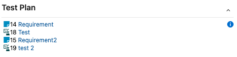

# Test-plan

Add test plan for current work item.



If under a requirement or a requirement only requirement's tests
else all tests of parent feature

## To Build

```bash
npm run package-dev
```
 cx
### request tfx to build so

```bash
npm install -g tfx-cli
```
